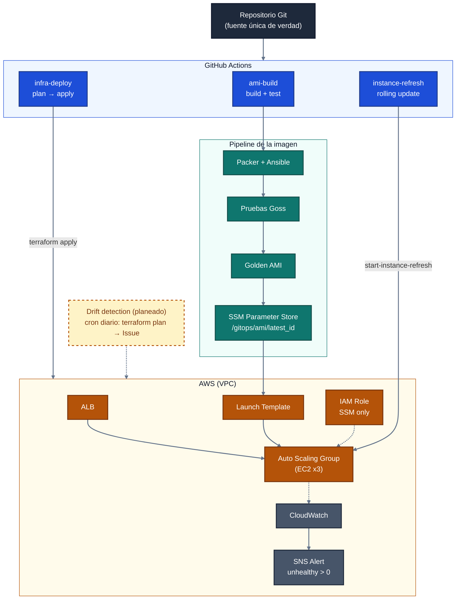

# Proyecto 10: GitOps e Infraestructura Inmutable

**Packer + Ansible + Terraform + GitHub Actions en AWS**

Infraestructura inmutable gestionada con GitOps: cada cambio genera una **nueva AMI**, se prueba automáticamente y reemplaza por completo las instancias anteriores, **sin downtime**. Ningún cambio en producción ocurre por fuera de Git.

| Campo | Valor |
|---|---|
| Plataforma cloud | Amazon Web Services (AWS) |
| Nivel de dificultad | Avanzado |
| Duración estimada | 8 semanas |
| Equipo | 4 estudiantes |
| Paradigma | Infraestructura inmutable + GitOps |

## Integrantes

- Keren Saray Subiroz Galvan
- Mariana Oliver Palis
- Juan J. Martínez
- Gabriel Antonio González Puello

## Objetivos de aprendizaje

- Aplicar el paradigma de **infraestructura inmutable** frente al modelo mutable tradicional.
- Construir **Golden AMIs** de forma automatizada con **Packer**.
- Usar **Ansible** como provisioner dentro del build de Packer.
- Probar la AMI con **Goss** antes de aprobarla como "golden".
- Hacer rolling updates sin downtime con **Instance Refresh** en un Auto Scaling Group.
- Aplicar **GitOps**: Git como única fuente de verdad.
- Acceder a las instancias con **SSM Session Manager**, sin SSH ni bastion host.

---

## Arquitectura

### Vista general



### Flujo paso a paso

1. **Push a Git.** Un cambio en `packer/**` o `ansible/**` dispara `ami-build`. Un cambio en `terraform/**` dispara `infra-deploy`.
2. **Build de la AMI.** Packer lanza una instancia temporal, Ansible la configura (nginx y dependencias) y Goss valida que nginx esté corriendo y escuchando en el puerto 80.
3. **Publicación.** Si todo pasa, se limpia la instancia, se sella la AMI y su ID se guarda en SSM Parameter Store (`/gitops/ami/latest_id`).
4. **Refresh del ASG.** Cuando `ami-build` termina bien en `main`, `instance-refresh` reemplaza las instancias del ASG de forma gradual (`MinHealthyPercentage: 50`).
5. **Infraestructura.** `infra-deploy` corre `terraform plan` y `apply` sobre `main`, y el Launch Template resuelve la AMI con `resolve:ssm:/gitops/ami/latest_id`.
6. **Monitoreo.** CloudWatch vigila el estado de las instancias y SNS avisa si hay alguna `unhealthy`.

### Componentes

| Componente | Herramienta | Qué hace | Ubicación |
|---|---|---|---|
| Imagen | Packer | Construye la Golden AMI (Ubuntu 22.04) | `packer/aws-ubuntu.pkr.hcl` |
| Configuración | Ansible | Instala nginx y dependencias | `ansible/playbook.yml` |
| Pruebas | Goss | Valida servicio, proceso y puerto antes de sellar la AMI | `packer/goss/goss.yml` |
| Infraestructura | Terraform | VPC, ALB, ASG, Launch Template, IAM, CloudWatch, SNS | `terraform/` |
| Registro de AMI | SSM Parameter Store | Guarda el ID de la AMI vigente | `/gitops/ami/latest_id` |
| Acceso | SSM Session Manager | Acceso administrativo sin SSH | Rol IAM de las instancias |
| Autenticación CI/CD | OIDC | GitHub Actions asume un rol de AWS sin llaves estáticas | Secrets del repo |

### Workflows

| Workflow | Trigger | Acción |
|---|---|---|
| `ami-build.yml` | Push a `main` o `JuanFeatures` en `packer/**` y `ansible/**`, o manual | Build, test con Goss y actualización de SSM |
| `infra-deploy.yml` | Push a `main` en `terraform/**`, o manual | `terraform plan` y `apply` |
| `instance-refresh.yml` | Al terminar `ami-build` con éxito en `main`, o manual | Rolling update del ASG |

> La rama `JuanFeatures` construye la AMI para pruebas, pero **no** refresca el ASG.

---

## Estructura del repositorio

```text
.
├── .github/workflows/
│   ├── ami-build.yml
│   ├── infra-deploy.yml
│   └── instance-refresh.yml
├── ansible/
│   └── playbook.yml
├── packer/
│   ├── aws-ubuntu.pkr.hcl
│   └── goss/goss.yml
├── terraform/
│   ├── main.tf
│   ├── providers.tf
│   ├── variables.tf
│   └── outputs.tf
└── README.md
```

## Configuración requerida

Secrets del repositorio en GitHub:

| Secret | Descripción |
|---|---|
| `AWS_ROLE_ARN` | ARN del rol IAM que asumen los workflows vía OIDC |
| `AWS_REGION` | Región de AWS (por ejemplo `us-east-1`) |

## Estado del proyecto

- [x] Build de Golden AMI con Packer + Ansible
- [x] Pruebas con Goss
- [x] Actualización de SSM Parameter Store
- [x] Despliegue de infraestructura con Terraform
- [x] Instance Refresh automático
- [ ] Detección de drift (cron diario + Issue en GitHub)
